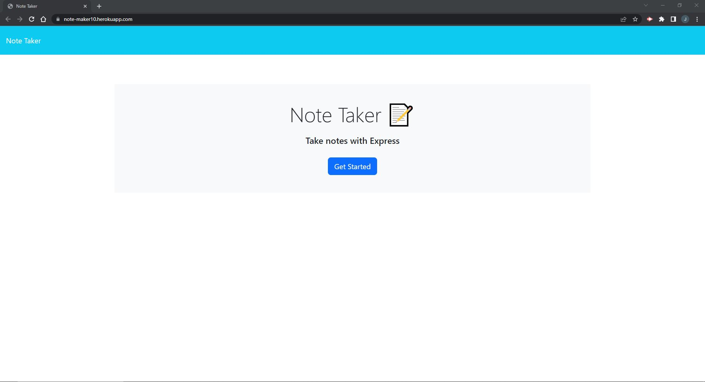
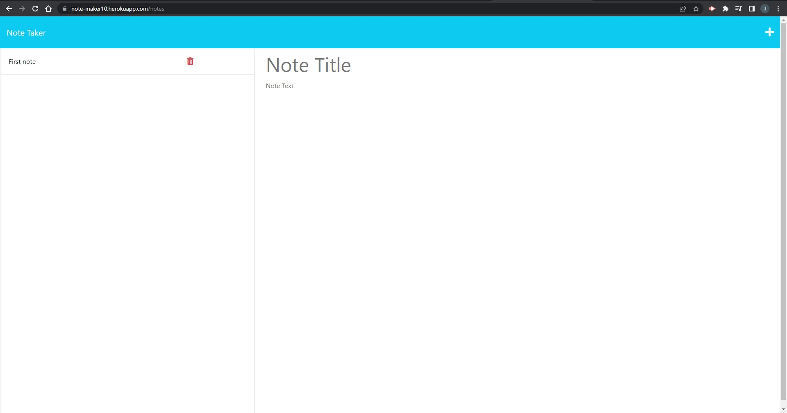

# Note Taker   
 
## Description  
This applications purpose is to allow users to make, manage and delete notes to help them stay productive, you can create notes with their own title, save them to the database, and then revisit or delete old notes you may have no use for anymore.  
## Table of contents
[Description](#description)  
[Installation](#installation)  
[Usage](#usage)  
[License](#license)  
[Contribution](#contribution)  
[Tests](#tests)  
[Questions](#questions)  
## Installation  
To run the application simply visit https://note-maker10.herokuapp.com/ but to install the application, git clone the repository to your device, open a terminal in the downloaded folder and open the terminal, once in the terminal, run npm i (or npm install) to install all necesarry dependencies for the application, then run node index.js and you are ready to answer the necesarry questions to generate your profesional README. I have a link to a video tutorial on how to install and run the code inside the "usage" section of this README.  

## Usage  
To use the application just visit https://note-maker10.herokuapp.com/ and click get started, then, just add any notes you want with a title. Click the save button on the top right of the screen to save your notes, or the plus button next for a blank sheet. You can view all of your saved notes on the left hand side of the screen, click the title of the note you wish to view and it should appear on the right side of the screen.
## License  
N/A
## Contributing  
To contribute to this project, git clone this repository to your device, make a branch to add work to this project, then once your work is complete request a merge to be reviewed and merged to the project.
## Tests  
To test this application, simply run the application as stated in usage, or by cloning the project to your own device as stated in installation.   
## Questions  
If you have any questions about this application, contact me via either my email address or my GitHub account.  
My email address: jakeorchard@live.co.uk  
My GitHub URL: https://github.com/Jake-Orch